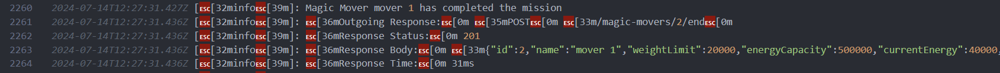

# Magic Transporters


## Table of Contents

1. [Project Overview](#project-overview)
2. [Architecture](#architecture)
3. [.env Configuration](#env-configuration)
4. [Setup and Installation](#setup-and-installation)
5. [Running the Project](#running-the-project)
6. [Business Functionality](#business-functionality)
7. [Logging and Monitoring](#logging-and-monitoring)
8. [API Documentation](#api-documentation)
9. [Conclusion](#conclusion)

## Project Overview

Magic Transporters is an application designed to manage magical movers and items. The application includes functionalities for creating, updating, and managing movers and items, and provides a robust logging system for monitoring activities.

## Architecture

The architecture of the Magic Transporters project is structured as follows:

- **NestJS**: A progressive Node.js framework for building efficient, reliable, and scalable server-side applications.
- **PostgreSQL**: An advanced, enterprise-class, and open-source relational database system.
- **TypeORM**: An ORM for TypeScript and JavaScript (ES7, ES6, ES5), supporting multiple database systems.

### Code Quality and Best Practices

#### Dependency Injection:

Used throughout the application to reduce coupling and enhance modularity.

#### Service-Oriented Architecture:

Ensures each service is focused on a specific functionality.

#### Comprehensive Logging:

Provides detailed insights into the application's operations and issues.

#### Modular Design:

Facilitates easier maintenance and scalability.

## Directory Structure

```
src/
├── common/
│ └── logging/
│ └── logger.service.ts
├── database/
│ └── database.module.ts
├── models/
│ ├── magic-items/
│ │ ├── dtos/
│ │ │ └── create-magic-item.dto.ts
│ │ ├── magic-item.entity.ts
│ │ ├── magic-item.module.ts
│ │ ├── magic-item.service.ts
│ │ └── repositories/
│ │ └── typeorm-magic-item.repository.ts
│ ├── magic-movers/
│ │ ├── dtos/
│ │ │ └── create-magic-mover.dto.ts
│ │ ├── enums/
│ │ │ └── quest-state.enum.ts
│ │ ├── magic-mover.entity.ts
│ │ ├── magic-mover.module.ts
│ │ ├── magic-mover.service.ts
│ │ └── repositories/
│ │ └── typeorm-magic-mover.repository.ts
│ └── missions/
│ ├── dtos/
│ │ └── create-mission.dto.ts
│ ├── mission.entity.ts
│ ├── mission.module.ts
│ └── mission.service.ts
├── app.module.ts
└── main.ts
```

## Setup and Installation

To get started with the project, follow these steps:

### Prerequisites

- Node.js (>= 14.x)
- PostgreSQL
- Docker

### Installation

1. **Clone the repository:**

```bash
git clone https://github.com/imohamedelshamy/magic-transporters
cd magic-transporters
```

### Configure environment variables:

Create a .env file in the root directory and add the necessary environment variables (see .env.example).

```bash
PORT=3000

DATABASE_HOST=localhost
DATABASE_PORT=5432
DATABASE_USER=your_db_user
DATABASE_PASSWORD=your_db_password
DATABASE_NAME=magic_transporters
```

### Install dependencies:

```bash
npm install
```

### Set up the database:

Ensure PostgreSQL is running and create the required database.

Create a .env file in the root directory with the following variables:

## Run the database migrations

```bash
npm run migration:run
```

### Running the Project

To run the project in development mode:

```bash
npm run start:dev
```

### Using Docker

To run the application using Docker, follow these steps:

Build the Docker image:

```bash
docker build -t magic-transporters .
Run the Docker container:

docker run --env-file .env -p 3000:3000 magic-transporters
```

## Business Functionality

The Magic Transporters application provides the following business functionalities:

### Movers Management

Create Magic Mover: Create new magical movers with attributes like name, weight limit, energy capacity, etc.

Update Magic Mover: Update existing movers' details.

Manage Energy: Monitor and update movers' energy levels.

### Items Management

Create Magic Item: Create new magical items with attributes like name, weight, and energy requirements.

hint: i related item energy to its weight to achieve more real functionality.

### Missions Management

Create Missions: Define missions for movers.

Assign Movers to Missions: Assign available movers to specific missions based on their current state.

## Logging and Monitoring

The application uses Winston with colorize and details info for logging. Logs are output to the console and stored in application.log to store the logs.

### Log example

```bash
this.logService.log(
  `Magic Item ${magicItem.name} created with weight ${magicItem.weight} and energy takes ${magicItem.energyTakes}`
);
```

response example from the application.log file


## API Documentation

The controllers and DTOs are documented using @nestjs/swagger. To access the Swagger UI, start the application and navigate to http://localhost:3000/api.

## Conclusion

Magic Transporters is designed to efficiently manage magical movers and items with robust logging and monitoring capabilities. By following best practices such as dependency injection and modular design, the application ensures maintainability and scalability.
